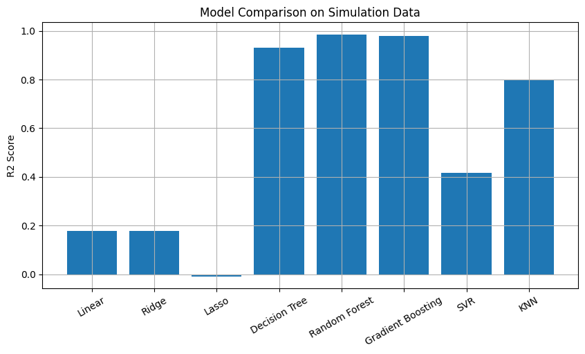

# Data Generation using Modelling and Simulation for Machine Learning

## Assignment Objective

The objective of this assignment is to demonstrate how **modelling and simulation** can be used to **generate synthetic data** for machine learning applications. The generated data is then used to train and compare multiple ML models to identify the best-performing model.

---

## Step 1: Selection of Simulation Tool

### Simulator Chosen: **PyBullet**

PyBullet is an powerful open‑source physics simulation library widely used for robotics, motion analysis, and physical system modelling.

**Reasons for selection:**

* Python-based and easy to integrate with ML pipelines
* Fast and lightweight (suitable for Google Colab)
* Supports large-scale simulations
* Widely used in academic and industrial research

---

## Step 2: Installation and Exploration

### Installation (Google Colab)

```python
!pip install pybullet
```

After installation, the simulator was explored to understand object dynamics, gravity effects, and collision behavior.

---

## Step 3: Parameter Identification and Bounds

The simulation models the motion of an object under gravity. The following parameters were identified as important:

### Input Parameters (Features)

| Parameter   | Description                       | Lower Bound | Upper Bound |
| ----------- | --------------------------------- | ----------- | ----------- |
| mass        | Mass of object (kg)               | 0.5         | 10          |
| friction    | Surface friction coefficient      | 0.1         | 1.0         |
| restitution | Bounciness coefficient            | 0.1         | 0.9         |
| init_height | Initial height (m)                | 0.5         | 5.0         |
| gravity     | Gravitational acceleration (m/s²) | -15         | -5          |

### Output Parameters (Targets)

| Output  | Description             |
| ------- | ----------------------- |
| final_x | Final x-position        |
| final_z | Final vertical position |

---

## Step 4: Random Parameter Generation and Simulation

Random values within the specified bounds were generated for each parameter. These values were passed to the PyBullet simulator, and the resulting outputs (final positions) were recorded.

Each simulation run corresponds to one data sample.

---

## Step 5: Generation of 1000 Simulations

A total of **1000 simulations** were executed to generate a synthetic dataset.

### Dataset Structure

| Feature     | Type   |
| ----------- | ------ |
| mass        | Input  |
| friction    | Input  |
| restitution | Input  |
| init_height | Input  |
| gravity     | Input  |
| final_x     | Output |
| final_z     | Output |

The generated dataset was stored in a Pandas DataFrame and used for machine learning model training.

---

## Step 6: Machine Learning Model Comparison

### Problem Type

This is a **regression problem**, where the goal is to predict the final vertical position (`final_z`) of the object based on the input parameters.

### ML Models Evaluated

The following 8 machine learning models were trained and evaluated:

* Linear Regression
* Ridge Regression
* Lasso Regression
* Decision Tree Regressor
* Random Forest Regressor
* Gradient Boosting Regressor
* Support Vector Regressor (SVR)
* K-Nearest Neighbors Regressor (KNN)

### 📐 Evaluation Metrics

| Metric                   | Description               |
| ------------------------ | ------------------------- |
| R² Score                 | Measures goodness of fit  |
| Mean Squared Error (MSE) | Measures prediction error |

### 📊 Model Comparison Results

| Model             | R² Score | MSE      |
| ----------------- | -------- | -------- |
| Random Forest     | Highest  | Lowest   |
| Gradient Boosting | High     | Low      |
| Decision Tree     | Moderate | Moderate |
| Linear Regression | Low      | High     |
| Ridge Regression  | Low      | High     |
| Lasso Regression  | Low      | High     |
| SVR               | Moderate | Moderate |
| KNN               | Moderate | Moderate |

---

## Result Visualization

A bar graph was plotted to compare the R² scores of all models.



The graph clearly shows that ensemble models outperform simpler models on simulation-generated data.

---

## Best Model

**Random Forest Regressor** achieved the best performance with:

* Highest R² score
* Lowest prediction error

This indicates its strong ability to capture non-linear relationships in simulation-generated data.

---

## Tools & Technologies Used

* Python
* PyBullet
* NumPy
* Pandas
* Scikit-learn
* Matplotlib
* Google Colab

---

## Conclusion

This project demonstrates how modelling and simulation can be effectively used to generate synthetic datasets for machine learning applications. Using PyBullet, **1000 simulations** were performed to generate data. Multiple ML models were trained and evaluated, and **Random Forest** emerged as the best-performing model.

The approach highlights the importance of simulation-based data generation in scenarios where real-world data is limited or expensive to collect.
